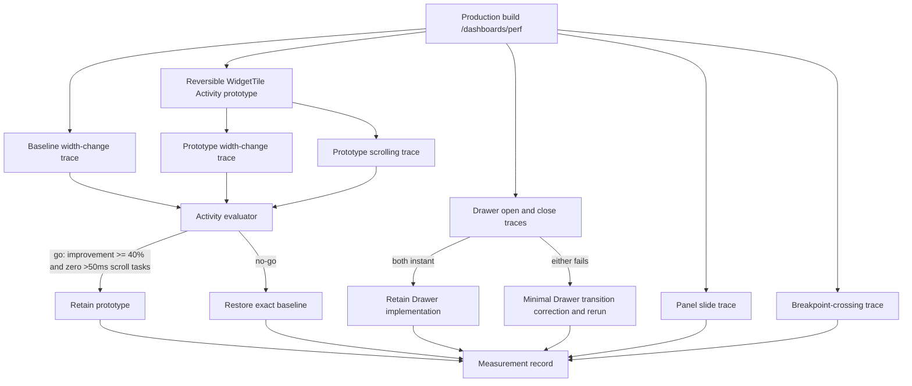

# Design Document: Shell Performance Remaining Tasks

## Overview

This design completes only the three unchecked Plan 01 performance items:

1. prototype and evaluate React 19 `Activity` for far dashboard tiles;
2. verify that Mantine Drawers open and close instantly when the application motion setting is `reduce` while operating-system reduced motion is off; and
3. measure panel-slide long-task overlap and chart resize delivery when a context-bar toggle crosses a grid breakpoint.

The work is an experiment and verification pass, not a general performance refactor. The Activity change is isolated and reversible, Drawer source changes are conditional on a failed trace, and the final measurements and decisions are recorded in `docs/grid-and-charts.md`. No dashboard model, API, store, route, chart, grid-layout, or shell-state contract changes.

## Goals and Non-Goals

### Goals

- Preserve the existing 200 px first-mount latch, tile containment and `content-visibility`, per-widget error boundary, per-widget `Suspense`, and registry-selected skeleton.
- Give already-mounted far tiles a separate visibility policy that can tear down chart effects without discarding widget state.
- Compare baseline and prototype with equivalent production-build Chrome traces and an explicit decision formula.
- Prove Drawer behavior under the application preference independently of the OS preference.
- Distinguish long work during the 180 ms panel animation from the accepted chart reflow after the animation.
- Count breakpoint-crossing chart resize observations without turning the count into a pass/fail threshold.

### Non-Goals

- Optimizing chart implementations, changing React Grid Layout behavior, changing shell pinning, or reducing bundle size.
- Averaging multiple benchmark runs or creating a permanent telemetry subsystem.
- Adding a resize-count performance budget.
- Changing Mantine Drawer configuration when both controlled traces already satisfy the instant-transition criterion.
- Retaining any Activity code after a `no-go` result.

## Architecture



The production application remains the system under test. Chrome DevTools is the trace recorder. Temporary DevTools snippets may add `performance.mark` calls and `ResizeObserver` logging, but they are not checked into application source. The only unconditional source edit under evaluation is the reversible `WidgetTile` Activity prototype.

## Components and Interfaces

### 1. Reversible `WidgetTile` Activity Prototype

**Primary file:** `src/features/dashboards/components/grid/WidgetTile.tsx`

**Preserved supporting files:**

- `src/features/dashboards/components/grid/DashboardGrid.module.css` continues to apply `contain: layout style` and `content-visibility: auto` to `.react-grid-item`.
- `src/features/dashboards/components/grid/WidgetTile.module.css` keeps body sizing and `overflow: hidden` unchanged.
- `src/features/dashboards/components/widgets/widgetKinds.tsx` remains the source of the matching widget component and skeleton.

The prototype adds a React 19 `Activity` boundary and a second Mantine `useIntersection` call. It does not replace or overload the existing first-mount observer.

```ts
import { Activity, Suspense, useId, useState } from 'react';
import { useIntersection } from '@mantine/hooks';

type TileActivityMode = 'visible' | 'hidden';

interface TileVisibilityState {
  seen: boolean;
  nearViewport: boolean;
  withinFarMargin: boolean;
  activityMode: TileActivityMode;
  showSkeleton: boolean;
}
```

#### Observer responsibilities

| Observer                | Target                                                   | Margin                                                                                                                 | Responsibility                                                |
| ----------------------- | -------------------------------------------------------- | ---------------------------------------------------------------------------------------------------------------------- | ------------------------------------------------------------- |
| First-mount observer    | Existing tile body `Box`                                 | `200px`                                                                                                                | Changes `seen` from `false` to `true`; never changes it back. |
| Far-visibility observer | Tile root `Paper` or an equivalent distinct tile element | Vertical margin targeted at `2.0 × viewportHeight`, constrained to `1.8–2.2 × viewportHeight`; horizontal margin `0px` | Selects `Activity` mode only after content has been mounted.  |

The far margin is represented in pixels because `IntersectionObserver.rootMargin` accepts pixels or percentages, not viewport units. It is derived from the current vertical viewport height when the observer options are established. A retained implementation may refresh this value on a vertical viewport-height change, but it must not subscribe every tile to width-only changes or couple it to the 200 px latch. The controlled experiment keeps viewport height fixed, making the configured margin stable and equivalent in both traces.

The second observer entry defaults to visible while it is `null`; an unavailable first observation must not hide an already-rendered tile. The presentation rules are:

```ts
const nextSeen = seen || nearEntry?.isIntersecting === true;
const withinFarMargin = farEntry?.isIntersecting ?? true;
const activityMode = nextSeen && !withinFarMargin ? 'hidden' : 'visible';
const showSkeleton = !nextSeen || activityMode === 'hidden';
```

The render composition remains explicit:

```tsx
<WidgetBoundary name={widget.title}>
  {!seen ? (
    kind.skeleton
  ) : (
    <>
      {activityMode === 'hidden' ? kind.skeleton : null}
      <Activity mode={activityMode}>
        <Suspense fallback={kind.skeleton}>
          <kind.component dashboardId={dashboardId} widget={widget} />
        </Suspense>
      </Activity>
    </>
  )}
</WidgetBoundary>
```

This composition guarantees:

- `Activity` never causes a first mount before the existing 200 px latch.
- Once first-mounted, widget state remains mounted across far/near changes.
- A hidden Activity tears down widget effects, including chart resize subscriptions, while React may still render hidden children at lower priority.
- The skeleton outside the hidden Activity prevents a fast scroll from revealing an empty tile.
- The existing `Suspense` fallback still handles lazy chunk/data suspension while visible.
- The existing `WidgetBoundary` continues to contain widget errors and encloses both skeleton and Activity content.

#### Reversibility

Before applying the prototype, preserve the baseline diff for `WidgetTile.tsx`. The prototype must not alter shared types, persisted state, DTOs, stores, or CSS. If the decision is `no-go`, restore the exact baseline `WidgetTile.tsx` and verify that no `Activity`, far observer, far-margin constant/helper, or prototype-only test remains. If the decision is `go`, retain the component and its automated tests.

### 2. Drawer Transition Verification

**Existing implementation under test:**

- `src/hooks/useMotion.ts` resolves application and OS motion preferences.
- `src/app/Providers.tsx` selects `reducedMotionTheme` and sets `data-motion="reduce"`.
- `src/design-system/theme/theme.ts` gives Drawer a default `transitionProps.duration` of `0` in `reducedMotionTheme`.
- `src/components/layouts/shell/Shell.tsx` renders the sidebar and context-bar Drawers.

The design first tests this implementation unchanged. A trace passes only when both conditions hold:

1. resolved Drawer transition duration is configured as `0 ms`; and
2. the Chrome trace screenshots/animation track show no animated intermediate presentation between the settled closed and open states, or between the settled open and closed states.

If both directions pass, retain the current implementation with no Drawer source edit. If either direction fails, make the smallest central correction before repeating the failed trace. Prefer fixing the `Drawer` default in `reducedMotionTheme` so both shell Drawers remain consistent. An instance-level `transitionProps` in `Shell.tsx` is a fallback only if Mantine does not consume the theme default in the rendered Drawer. Focus trapping, return focus, overlay behavior, escape handling, and unmount semantics remain unchanged.

### 3. Performance Evaluation Model

The following conceptual record defines calculations and documentation fields. It does not require a production runtime model.

```ts
type PassFail = 'pass' | 'fail';
type ActivityDecision = 'go' | 'no-go';
type DrawerDecision = 'retain' | 'change-and-repeat';

interface TraceEnvironment {
  buildCommit: string;
  chromeVersion: string;
  viewport: { width: number; height: number; devicePixelRatio: number };
  zoomPercent: 100;
  cpuThrottling: 'none';
  networkThrottling: 'none';
  appWindowForeground: true;
}

interface ActivityMeasurement {
  baselineScriptingMs: number;
  prototypeScriptingMs: number;
  improvementPercent: number;
  scrollingLongTaskCount: number;
  decision: ActivityDecision;
}

interface DrawerDirectionResult {
  configuredDurationMs: number;
  intermediateFrameObserved: boolean;
  result: PassFail;
}

interface DrawerMeasurement {
  applicationMotion: 'reduce';
  osReducedMotion: false;
  open: DrawerDirectionResult;
  close: DrawerDirectionResult;
  decision: DrawerDecision;
}

interface ShellMeasurement {
  panelAnimationDurationMs: 180;
  overlappingLongTaskCount: number;
  panelSlideResult: PassFail;
  chartResizeCount: number;
  chartResizeClassification: 'informational';
}
```

## Controlled Production Trace Methodology

### Common Controls

1. Run `pnpm build`, then serve the generated build with `pnpm preview`; measurements must not use the Vite development server.
2. Open `/dashboards/perf` in the same Chrome version for all scenarios.
3. Use one fixed viewport, device-pixel ratio, 100% zoom, no CPU throttling, and no network throttling. Keep the application window in the foreground.
4. Close unrelated tabs and DevTools extensions that add page work. Enable trace screenshots for Drawer runs.
5. Warm the route, widget chunks, fonts, and data before recording. Wait until network activity, layout, and charts settle.
6. Reset scroll position and shell state to the scenario-specific initial state before each trace.
7. Record exactly one named action. Mouse movement, resizing DevTools, opening another panel, backgrounding the window, or an unrelated network/refetch event invalidates the trace.
8. Save one representative trace per required scenario. Record the environment and exact action in the measurement record so equivalence is reviewable.

### Activity: Baseline and Prototype Width Change

Use a panel toggle that produces one final dashboard-canvas width change without crossing an RGL breakpoint; the breakpoint-crossing case is measured separately. Use the same panel, direction, initial widths, viewport, warmed dashboard state, and pointer/keyboard action for baseline and prototype.

For each configuration:

1. Start with the selected panel in the same settled state and `/dashboards/perf` at the top.
2. Begin recording before the toggle.
3. Toggle once and stop only after the shell releases the main-width lock and the resulting chart resize work settles.
4. Select the width-change work interval from the first post-release dashboard/chart resize delivery through the final main-thread task caused by that width change. Exclude the preceding 180 ms pane animation from both values.
5. In Chrome Performance Summary/Bottom-Up, record the main-thread **Scripting** duration for that selected interval. Use the same category and selection rule for both traces.

Let `B` be baseline scripting milliseconds and `P` prototype scripting milliseconds. `B` must be greater than zero.

```text
Scripting-Time Improvement (%) = ((B - P) / B) × 100
```

Keep full precision for the decision and round only the displayed documentation value (one decimal place). A negative value means the prototype regressed.

### Activity: Scrolling Long Tasks

Run only with the prototype active. First scroll through the full dashboard once outside the trace to warm all lazy chunks/data and set each first-mount latch, return to the top, and wait for idle. Then record one controlled, continuous scroll from top to bottom and back to top at a steady input rate.

Count every main-thread task whose duration is strictly greater than `50 ms` and whose execution lies in the measured scrolling interval. Record both the count and the longest duration. The requirement passes only when the count is zero. Loading work caused by an incomplete warm-up invalidates the trace rather than being silently removed.

### Activity Decision

```ts
const decision: ActivityDecision = improvementPercent >= 40 && scrollingLongTaskCount === 0 ? 'go' : 'no-go';
```

- `go`: retain the Activity prototype and tests.
- `no-go`: restore the exact baseline source and classify the result as `no-go` even if only one condition failed.

### Drawer Open and Close

Use a viewport below the shell `md` threshold so the selected panel renders as a Drawer. Before each trace:

- set `motion.v1` to `reduce` through Settings › Appearance;
- verify `data-motion="reduce"` on `<html>`;
- disable OS reduced motion and ensure Chrome is not emulating `prefers-reduced-motion: reduce`;
- confirm the Drawer theme duration resolves to `0`;
- settle the page before recording.

Capture separate traces:

1. **Open:** start with the Drawer closed, record, trigger one open action, and stop after the final open frame.
2. **Close:** start with the Drawer open and settled, record, trigger one close action, and stop after the final closed frame.

Inspect Event/Main, Animations, and screenshots. A direction is instant only if duration is `0 ms` and no intermediate translated/faded Drawer frame appears. The first presented state after the triggering action may be the final state; there must be no progression over subsequent frames. If a direction fails, make the conditional transition correction and repeat that direction under the same controls before recording the final decision.

### Panel Slide Long-Task Overlap

Use normal motion and one docked panel toggle that executes the `flex-basis` transition defined by `--app-motion-base` (`180 ms`). The full animation interval begins at the pane's `transitionrun`/first transition frame and ends at `transitionend`/the settled frame. A DevTools snippet may attach listeners and emit User Timing marks so the interval boundaries are visible without changing application source.

For each main-thread task with duration greater than `50 ms`, treat it as overlapping when:

```text
task.start < animation.end AND task.end > animation.start
```

The result passes only when the number of overlapping long tasks is zero. A chart reflow beginning after `animation.end` is documented separately but does not fail this criterion.

### Breakpoint-Crossing Chart Resize Count

Choose a viewport and starting context-bar state such that one context-bar toggle changes the dashboard canvas across exactly one configured breakpoint (`lg = 1100 px` or `md = 640 px`). Record the chosen breakpoint, starting canvas width, ending canvas width, and toggle direction.

Before the trace, attach one temporary `ResizeObserver` to each chart container and assign each container a stable trace label. Reset counters after observation is attached and the page is settled. Begin the scenario interval immediately before the context-bar toggle; end it after the shell unlock, RGL's responsive breakpoint commit, and two consecutive animation frames with no additional chart-container resize entry.

Count one resize event per `ResizeObserverEntry` for an observed chart container within the interval, not one per observer callback. Record:

- total chart resize count;
- number of observed chart containers; and
- per-container counts or a min/max distribution, so a result such as “twice per chart” remains visible.

The count is informational. It cannot change Activity, Drawer, or panel-slide pass/fail status and has no unsupported maximum.

## Decision and Rollback Matrix

| Area                | Passing evidence                                                   | Final action                 | Failing evidence                                               | Final action                                                     |
| ------------------- | ------------------------------------------------------------------ | ---------------------------- | -------------------------------------------------------------- | ---------------------------------------------------------------- |
| Activity            | Improvement `>= 40%` **and** zero scrolling tasks `>50 ms`         | Keep Activity prototype      | Improvement `<40%` **or** at least one scrolling task `>50 ms` | Restore baseline exactly; record `no-go`                         |
| Drawer              | Open and close both have `0 ms` duration and no intermediate frame | Keep existing implementation | Either direction fails either condition                        | Make minimal central fix and repeat failed direction             |
| Panel slide         | Zero `>50 ms` tasks overlap the complete 180 ms interval           | Record pass                  | One or more overlap                                            | Record fail; no unrelated optimization is implied by this design |
| Breakpoint crossing | Any nonnegative observed count                                     | Record informational result  | Not applicable                                                 | Count never gates acceptance                                     |

## Error Handling and Invalid Evidence

- **Baseline scripting is zero or missing:** do not divide; mark the pair invalid and recapture both equivalent width-change traces.
- **Incomplete trace interval:** recapture rather than infer missing start/end work.
- **Non-equivalent Activity traces:** recapture both when viewport, panel direction, initial state, warm-up, throttling, or interval-selection method differs.
- **Backgrounded or contaminated trace:** discard any trace with window backgrounding, unrelated user input, DevTools resize, refetch, or cold lazy loading.
- **Far observer entry is initially `null`:** default Activity to visible; never flash hidden content or undo `seen`.
- **Drawer environment mismatch:** a trace with OS/browser reduced-motion emulation enabled does not prove the application preference and must be recaptured.
- **Drawer failure:** do not record “retain”; apply a conditional implementation correction and rerun the failed direction.
- **Observer instrumentation misses a chart container:** mark the breakpoint count invalid and repeat after all expected containers are registered.
- **Activity no-go cleanup:** source review, tests, and repository search must confirm that all prototype-only code is removed before final validation.

## Correctness Properties

_A property is a behavior that must hold across all valid executions or generated inputs. These properties cover pure state and evaluator logic; browser rendering and trace capture remain example-based or integration verification._

### Property 1: First-mount state is monotonic

For any sequence of near-viewport and far-viewport intersection events, a tile's `seen` state becomes true if and only if at least one near-viewport event intersects, and once true it never becomes false regardless of later far-visibility events.

**Validates: Requirements 1.1**

### Property 2: Scripting improvement uses the baseline denominator

For all positive baseline scripting durations and all nonnegative prototype scripting durations, the calculated improvement equals `((baseline - prototype) / baseline) × 100`; display rounding must not alter the unrounded value used by the decision rule.

**Validates: Requirements 1.7**

### Property 3: Activity decision is exhaustive and reversible

For any scripting-improvement value and any nonnegative scrolling long-task count, the Activity decision is `go` if and only if improvement is at least `40` and the count is zero; every other combination produces `no-go` and requires restoration of all prototype-only Activity code.

**Validates: Requirements 1.8, 1.9, 1.10**

### Property 4: Drawer decision requires both directions

For any pair of Drawer open and close instant-transition results, the existing implementation is retained if and only if both results pass; if either result fails, the decision is `change-and-repeat` for each failed direction.

**Validates: Requirements 2.5, 2.6**

### Property 5: Resize count is accurate and non-gating

For any timestamped stream of resize entries, scenario interval, and set of observed chart containers, the Chart Resize Count equals the number of entries belonging to those containers within the interval; for any nonnegative resulting count, changing only that count cannot change any pass-or-fail decision.

**Validates: Requirements 3.4, 3.5, 3.6**

## Testing Strategy

### Automated unit and component tests

- Add focused `WidgetTile` tests with a controllable `IntersectionObserver` stub:
  - confirm separate `200px` and approximately `2 × viewportHeight` observer configurations;
  - confirm far events cannot first-mount content;
  - confirm near intersection latches content permanently;
  - confirm a seen far tile shows the registry skeleton while Activity content is hidden;
  - confirm returning within the far margin restores the same mounted widget state;
  - confirm `WidgetBoundary` and `Suspense` behavior remains intact.
- Keep `src/app/Providers.test.tsx` coverage proving `motion.v1=reduce` selects a Drawer duration of `0` and that the setting updates without reload.
- If the Drawer implementation changes, add or update a Shell behavior test for both Drawer instances and the reduced-motion theme path. Do not add a source change or test merely to duplicate passing trace evidence.
- Preserve existing tests for shell pinning, dashboard rendering, lazy widgets, and motion preferences.

### Property tests

Implement each pure property with at least 100 generated cases. Each test name or comment must use:

```text
Feature: shell-performance-remaining-tasks, Property N: <property title>
```

Use generated boolean event sequences for Property 1, numeric duration pairs including values around the 40% boundary for Properties 2–3, all Drawer boolean combinations for Property 4, and timestamped mixed resize streams for Property 5. If no property-testing dependency is approved, use a deterministic seeded generator in test-only code; do not add runtime dependencies for the measurement pass.

### Browser integration verification

Automated tests cannot replace the seven required production traces:

1. baseline width change;
2. prototype width change;
3. prototype scrolling;
4. Drawer open;
5. Drawer close;
6. panel slide;
7. breakpoint crossing.

The list contains seven traces because Drawer open and close are separate controlled scenarios. Each result must be reviewed against the exact interval and threshold definitions above.

### Repository validation

After the final go/no-go and any conditional Drawer correction, run:

```bash
pnpm exec vitest run <affected-test-files>
pnpm test
pnpm lint
pnpm format:check
pnpm typecheck
pnpm build
```

For Activity `no-go`, validation runs after restoration. For Activity `go`, it runs with the retained prototype. A production build is required again after any Drawer correction before repeating browser traces.

## Documentation Update

Update only the relevant performance and motion sections of `docs/grid-and-charts.md`. Do not rewrite completed Plan 01 history. Add the measurement date and controlled environment, then record:

### Activity

| Field                            | Required value                                                |
| -------------------------------- | ------------------------------------------------------------- |
| Baseline width-change scripting  | milliseconds                                                  |
| Prototype width-change scripting | milliseconds                                                  |
| Improvement                      | unrounded decision value and one-decimal displayed percentage |
| Prototype scrolling long tasks   | count of tasks `>50 ms` and longest duration                  |
| Decision                         | `go` or `no-go`                                               |
| Final source state               | prototype retained or baseline restored                       |

### Drawer

Record application motion `reduce`, OS/browser reduced motion off, open duration/intermediate-frame result, close duration/intermediate-frame result, and `retain` or `change-and-repeat`. If a correction was required, record the final corrected trace result rather than presenting the failed run as final evidence; preserve a short note that a rerun occurred.

### Panel and breakpoint

Fill the existing “Long tasks during the animation” measured cell with the overlap count/result for the complete 180 ms interval. Add or fill the breakpoint-crossing resize row with total count, observed chart count, per-chart distribution, crossed breakpoint, and an explicit `informational—not pass/fail` label. Leave the existing accepted post-animation chart-reflow note intact.

## Requirements Traceability

| Requirement | Design coverage                                                                                             |
| ----------- | ----------------------------------------------------------------------------------------------------------- |
| 1.1–1.4     | Separate observers, monotonic mount latch, Activity/skeleton composition, preserved CSS/boundaries/Suspense |
| 1.5–1.7     | Equivalent width traces and explicit scripting formula                                                      |
| 1.8–1.10    | Exhaustive go/no-go and rollback matrix                                                                     |
| 1.11        | Activity documentation fields                                                                               |
| 2.1–2.4     | Separate controlled Drawer traces and instant criterion                                                     |
| 2.5–2.6     | Conditional central correction and retain/change decision                                                   |
| 2.7         | Drawer documentation fields                                                                                 |
| 3.1–3.2     | Complete 180 ms interval and strict overlap rule                                                            |
| 3.3–3.6     | Breakpoint setup, entry counting, and informational classification                                          |
| 3.7         | Panel/breakpoint documentation fields                                                                       |

## References

- [React `<Activity>` reference](https://react.dev/reference/react/Activity)
- [Mantine `useIntersection`](https://mantine.dev/hooks/use-intersection/)
- [Mantine Drawer transitions](https://mantine.dev/core/drawer/)
- [MDN `IntersectionObserver` constructor and `rootMargin`](https://developer.mozilla.org/en-US/docs/Web/API/IntersectionObserver/IntersectionObserver)

Reference content was rephrased for compliance with licensing restrictions.
