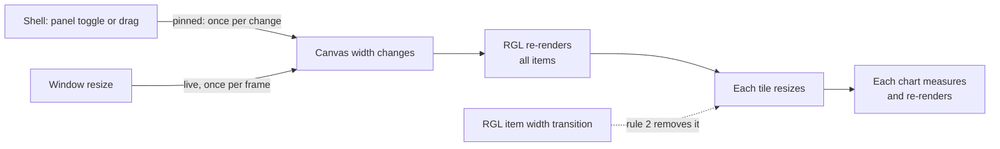

# Dashboard grid and charts

Performance rules for the dashboard canvas: react-grid-layout v2 (RGL) tiles holding charts (`@mantine/charts`, Recharts 3). The grid is not built yet; follow these rules when it is. Model and registries are in [plan.md](plan.md#dashboard-core-phases-3-to-6); the shell side is in [shell.md](shell.md).

## The cost to avoid

Anything that changes the canvas width on every frame multiplies through every tile and chart. The shell already cuts the biggest source (panel animations and drags); the rules below keep the grid from creating its own.



Measured on the current shell: during one sidebar collapse the unpinned navbar resized 22 times, the pinned page content once.

## Grid

1. **Width.** Use `useContainerWidth` as it is. The shell pins `<main>` while panels move, so the grid sees one width change per toggle or drag. Do not add a debounce of your own.
2. **Tile transitions.** RGL's default stylesheet animates `width` and `height` on every item. Every layout change would then resize each chart on every frame for 200ms. Animate position only, and nothing under reduced motion:

   ```css
   .react-grid-item.cssTransforms {
     transition-property: transform;
   }
   ```

3. **Containment.** Tiles have explicit sizes from RGL, so each can be isolated: `contain: layout style` and `content-visibility: auto`. `content-visibility` also clips paint to the tile, so chart tooltips must stay inside it (Recharts' default) or use the Tooltip `portal` prop.
4. **Children.** Memoize the children array by widget ids, not by positions (RGL positions them), and make tiles `memo` components keyed by id. RGL compares children by reference.
5. **Config.** `gridConfig`, `dragConfig`, `resizeConfig` and the compactor are module constants, or `useMemo` when they depend on state. Pass `layout` from the store, never built inline.
6. **Saving.** Write the layout to the dashboard store in `onDragStop` and `onResizeStop`. `onLayoutChange` also fires on mount and on width changes; saving there would push undo entries (`zundo`) nobody made.
7. **Callbacks.** RGL v2 reads the latest layout through an internal ref, so callbacks need no `layout` dependency. Use the layout the callback receives.

## Widgets

- Each widget type is a `lazy()` chunk from the registry; each tile gets its own `Suspense` and `WidgetBoundary`.
- Mount a tile's content the first time it is near the viewport (Mantine `useInViewport`) and keep it mounted afterwards.
- Refetches keep old data (`placeholderData: keepPreviousData`); no skeleton on refetch.
- `select` functions live outside components so `data` keeps its reference until it changes (Query's structural sharing does the rest).

## Charts

- **`@mantine/charts` first.** Use raw Recharts only for what Mantine does not cover, with the `responsive` prop (Recharts 3.3+) instead of `ResponsiveContainer`.
- **Stable props.** `data`, `series`, formatters and especially function `dataKey`s keep their reference between renders: module constants, `useMemo` or `useCallback` (React Compiler does this once it is enabled). A new `dataKey` function makes Recharts recompute every point.
- **Big series.** Downsample to about one point per pixel of chart width (LTTB) before passing data in; no dots above about 100 points; `isAnimationActive={false}` for large series.
- **Tooltips.** Recharts 3.10 already throttles pointer events to animation frames (`throttleDelay: 'raf'`); nothing to add.
- **Sizing.** Mantine charts wrap Recharts' `ResponsiveContainer` with no debounce option. That is fine because widths change once per layout change (grid rules 1 and 2).

## Motion

- Mantine transitions follow the OS reduced-motion setting (`respectReducedMotion` in the theme).
- Chart animation and grid transitions will read an app `useReducedMotion()` that combines the OS setting with the planned Settings › Appearance option. It ships with that option.

## React Compiler

Decided: enable it with the grid work. With `@vitejs/plugin-react` v6 on Vite 8:

```ts
// vite.config.ts; needs @rolldown/plugin-babel, babel-plugin-react-compiler, @babel/core
import react, { reactCompilerPreset } from '@vitejs/plugin-react';
import babel from '@rolldown/plugin-babel';

plugins: [react(), babel({ presets: [reactCompilerPreset()] })];
```

The oxlint React Compiler rules are already on, so code written now stays compatible.

## Checking

Build a demo dashboard with about 20 chart tiles and record a Chrome Performance trace of: sidebar toggle, context bar toggle, handle drag, tile drag, tile resize.

| Target                             | Budget              |
| ---------------------------------- | ------------------- |
| Grid renders per panel toggle      | 1                   |
| Chart renders per panel toggle     | 1 per visible chart |
| Long tasks during any of the above | None over 50ms      |

The React Profiler shows render counts. To count resizes, attach a `ResizeObserver` to a tile and toggle the sidebar.

## Suggestions we checked

| Suggestion                                         | Verdict                                                                                                                         |
| -------------------------------------------------- | ------------------------------------------------------------------------------------------------------------------------------- |
| Split the shell context to stop broad re-renders   | Already done: the context holds a stable store; hooks select with `useShallow`                                                  |
| Pass heavy content as `children`                   | Already done: `Shell` receives the page as `children`                                                                           |
| Overlay the sidebar with `transform`               | No: a docked sidebar must push content. Pinning `<main>` gets the same benefit                                                  |
| `debounce={Infinity}` on charts during transitions | No: a hack, and Mantine charts do not expose `debounce`                                                                         |
| Work around RGL's `layoutRef`                      | Nothing to do: internal to RGL v2 (grid rule 7)                                                                                 |
| Primer's "5–15 to 50–60 fps" containment result    | Numbers not as quoted; see [primer/react#7251](https://github.com/primer/react/pull/7251). Containment goes on tiles, not panes |

Sources: [RGL README](https://github.com/react-grid-layout/react-grid-layout), [RGL changelog](https://github.com/react-grid-layout/react-grid-layout/blob/master/CHANGELOG.md), [Recharts performance](https://recharts.github.io/en-US/guide/performance/), [Recharts sizing](https://recharts.github.io/en-US/guide/sizes/), [plugin-react](https://github.com/vitejs/vite-plugin-react/tree/main/packages/plugin-react), [Web Interface Guidelines](https://github.com/vercel-labs/web-interface-guidelines).
