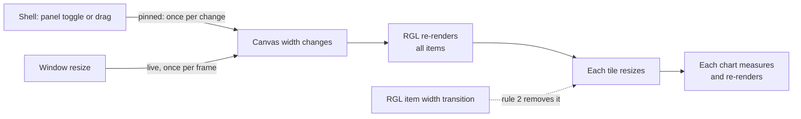

# Dashboard grid and charts

Performance rules for the dashboard canvas: react-grid-layout v2 (RGL) tiles holding charts (`@mantine/charts`, Recharts 3). The read-only grid is built (`features/dashboards/components/grid`); dragging and resizing tiles come with editing in phase 3. Model and registries are in [plan.md](plan.md#dashboard-core-phases-3-to-6); the shell side is in [shell.md](shell.md). The "Grid performance" dashboard (`/dashboards/perf`, 20 charts) is the test bed.

## The cost to avoid

Anything that changes the canvas width on every frame multiplies through every tile and chart. The shell already cuts the biggest source (panel animations and drags); the rules below keep the grid from creating its own.



Measured: during one sidebar collapse the unpinned navbar resized 22 times, the pinned page content once. On the test bed (production build), a panel toggle resizes each chart once; only the charts on or near the screen (12 of 20) re-render, which costs 150–250ms in one go. The shell runs that after its animation, not during it.

## Grid

1. **Width.** Use `useContainerWidth({ measureBeforeMount: true })`: without it every chart first renders at a guessed 1280px. The shell pins `<main>` while panels move, so the grid sees one width change per toggle or drag; do not add a debounce of your own. A change that crosses a breakpoint takes two commits (`ResponsiveGridLayout` switches breakpoints in an effect); they normally land before the next frame. Do not wrap the width update in `flushSync`: the effect's update still waits, and the in-between layout then gets painted.
2. **Tile transitions.** RGL's default stylesheet animates `width` and `height` on every item. Every layout change would then resize each chart on every frame for 200ms. Animate position only, and nothing under reduced motion:

   ```css
   .react-grid-item.cssTransforms {
     transition-property: transform;
   }

   .react-grid-layout {
     transition: none; /* RGL also animates the canvas height */
   }
   ```

3. **Containment.** Tiles have explicit sizes from RGL, so each can be isolated: `contain: layout style` and `content-visibility: auto`. `content-visibility` also clips paint to the tile, so chart tooltips must stay inside it (Recharts' default) or use the Tooltip `portal` prop. The tile body clips (`overflow: hidden`) rather than scrolls: for one frame after a tile shrinks its chart is still at the old width, and a scrollbar appearing then would resize the chart a second time.
4. **Children.** Memoize the children array by widget ids, not by positions (RGL positions them), and make tiles `memo` components keyed by id. RGL compares children by reference.
5. **Config.** `gridConfig`, `dragConfig`, `resizeConfig` and the compactor are module constants, or `useMemo` when they depend on state. Pass `layout` from the store, never built inline.
6. **Saving.** Write the layout to the dashboard store in `onDragStop` and `onResizeStop`. `onLayoutChange` also fires on mount and on width changes; saving there would push undo entries (`zundo`) nobody made.
7. **Callbacks.** RGL v2 reads the latest layout through an internal ref, so callbacks need no `layout` dependency. Use the layout the callback receives.

## Widgets

- Each widget type is a `lazy()` chunk from the registry; each tile gets its own `Suspense` and `WidgetBoundary`.
- Mount a tile's content the first time it comes within 200px of the viewport (Mantine `useIntersection` with `rootMargin`) and keep it mounted afterwards. The widget's chunk and query start then.
- Refetches keep old data (`placeholderData: keepPreviousData`); no skeleton on refetch.
- `select` functions live outside components so `data` keeps its reference until it changes (Query's structural sharing does the rest).

## Charts

- **`@mantine/charts` first.** Use raw Recharts only for what Mantine does not cover, with the `responsive` prop (Recharts 3.3+) instead of `ResponsiveContainer`.
- **Stable props.** `data`, `series`, formatters and especially function `dataKey`s keep their reference between renders: module constants, `useMemo` or `useCallback`. The React Compiler memoizes most of this; module constants still cost nothing and survive a component the compiler skips. A new `dataKey` function makes Recharts recompute every point.
- **Big series.** Downsample to about one point per pixel of chart width (LTTB) before passing data in; no dots above about 100 points; `isAnimationActive={false}` for large series.
- **Tooltips.** Recharts 3.10 already throttles pointer events to animation frames (`throttleDelay: 'raf'`); nothing to add.
- **Sizing.** Mantine charts wrap Recharts' `ResponsiveContainer` with no debounce option. That is fine because widths change once per layout change (grid rules 1 and 2).

## Motion

- Mantine transitions follow the OS reduced-motion setting (`respectReducedMotion` in the theme).
- Chart animation and grid transitions will read an app `useReducedMotion()` that combines the OS setting with the planned Settings › Appearance option. It ships with that option.

## React Compiler

Enabled: stable React Compiler 1.0 through Babel, in `vite.config.ts` (app and Storybook) and `vitest.config.ts` (tests run the compiled code). It adds about 2.5s to a production build. `@vitejs/plugin-react` also offers an experimental Rust port (`react({ compiler: true })`), a possible swap once it is stable.

```ts
// vite.config.ts; needs @rolldown/plugin-babel, babel-plugin-react-compiler, @babel/core
import react, { reactCompilerPreset } from '@vitejs/plugin-react';
import babel from '@rolldown/plugin-babel';

plugins: [react(), babel({ presets: [reactCompilerPreset()] })];
```

The oxlint React Compiler rules keep code compatible. One component is not compiled: `RouteError` uses `try`/`finally` without `catch`, which the compiler does not support yet.

## Checking

On `/dashboards/perf`, against a production build (`pnpm build`, then `pnpm preview` or the `preview` entry in `.claude/launch.json`), record a Chrome Performance trace of: sidebar toggle, context bar toggle, handle drag (later: tile drag and resize).

| Target                            | Budget                                  | Measured                                                       |
| --------------------------------- | --------------------------------------- | -------------------------------------------------------------- |
| Chart resizes per panel toggle    | 1 per chart on or near the screen       | 1 (12 of 20 charts)                                            |
| Long tasks during the animation   | None                                    | Skipped/not measured; overlap count and result are unavailable |
| Chart reflow after it             | One task; shrinks with fewer charts     | 150–250ms for 12 charts                                        |
| Breakpoint-crossing chart resizes | Informational—not pass/fail; no maximum | Skipped/not measured; resize counts are unavailable            |

Recharts 3 applies size changes through `useSyncExternalStore`, which React cannot split across frames, so a reflow of many charts is one long task. Keep it out of animations and off-screen charts out of it. The accepted 150–250ms chart-reflow observation begins after the animation and is not evidence for the unmeasured animation interval. To count resizes, attach a `ResizeObserver` to the chart containers; to time the work, observe `longtask` or `long-animation-frame` entries.

### Remaining performance and motion record

Record updated: 2026-09-24. Measurement date and controlled browser environment are not applicable: the manual production-browser tasks were skipped, so no Chrome version, viewport, device-pixel ratio, zoom, throttling, foreground-state, warmed-route, or scenario-control record exists. Unavailable values below are not zero-valued measurements.

#### Activity evaluation

| Field                            | Record                                                                                                                                                                                                        |
| -------------------------------- | ------------------------------------------------------------------------------------------------------------------------------------------------------------------------------------------------------------- |
| Measurement status               | Skipped/not measured: no baseline width-change trace, prototype width-change trace, or prototype scrolling trace was captured.                                                                                |
| Baseline width-change scripting  | Not measured; no duration exists.                                                                                                                                                                             |
| Prototype width-change scripting | Not measured; no duration exists.                                                                                                                                                                             |
| Improvement                      | Not applicable—not calculated because neither scripting duration exists. No raw or one-decimal percentage exists.                                                                                             |
| Prototype scrolling long tasks   | Not measured; neither a task count nor longest duration exists.                                                                                                                                               |
| Activity decision                | No measured `go` or `no-go` threshold decision was established. In the absence of evidence supporting `go`, the temporary prototype was conservatively rolled back; this is not a measured threshold failure. |
| Final source state               | Exact baseline `WidgetTile.tsx` restored at blob `63600aa1841c27b484cdb6bcc826b0d0aac880a0`; no prototype Activity behavior remains.                                                                          |

#### Reduced-motion Drawer verification

| Field                           | Record                                                                                                                                                                           |
| ------------------------------- | -------------------------------------------------------------------------------------------------------------------------------------------------------------------------------- |
| Measurement status              | Skipped/not measured: the unchanged open and close traces and the manual/conditional retest path were not run.                                                                   |
| Motion controls                 | Application `motion = reduce` with OS/browser reduced motion off was not established in a controlled trace.                                                                      |
| Open result                     | Not measured; configured duration and intermediate-frame result are unavailable.                                                                                                 |
| Close result                    | Not measured; configured duration and intermediate-frame result are unavailable.                                                                                                 |
| Decision and final source state | No trace-based retain-or-change decision exists. Without a failed unchanged-implementation trace, the conditional Drawer change did not apply and Drawer source was not changed. |
| Correction/rerun                | Not applicable; no correction or rerun occurred.                                                                                                                                 |

#### Panel slide and breakpoint crossing

| Field                            | Record                                                                                                                                                              |
| -------------------------------- | ------------------------------------------------------------------------------------------------------------------------------------------------------------------- |
| Panel-slide trace                | Skipped/not measured; no long-task overlap count or pass/fail result exists for the complete 180ms animation interval.                                              |
| Post-animation chart reflow      | The accepted 150–250ms observation for 12 charts remains recorded above and begins after the animation; it does not supply the missing panel-slide overlap result.  |
| Breakpoint-crossing trace        | Skipped/not measured; no crossed breakpoint, toggle direction, start/end canvas widths, observed chart count, total resize count, or per-chart distribution exists. |
| Breakpoint resize classification | `informational—not pass/fail`; no maximum is defined or inferred.                                                                                                   |

## Suggestions we checked

| Suggestion                                         | Verdict                                                                                                                         |
| -------------------------------------------------- | ------------------------------------------------------------------------------------------------------------------------------- |
| Split the shell context to stop broad re-renders   | Already done: the context holds a stable store; hooks select with `useShallow`                                                  |
| Pass heavy content as `children`                   | Already done: `Shell` receives the page as `children`                                                                           |
| Overlay the sidebar with `transform`               | No: a docked sidebar must push content. Pinning `<main>` gets the same benefit                                                  |
| `debounce={Infinity}` on charts during transitions | No: a hack, and Mantine charts do not expose `debounce`                                                                         |
| Work around RGL's `layoutRef`                      | Nothing to do: internal to RGL v2 (grid rule 7)                                                                                 |
| Primer's "5–15 to 50–60 fps" containment result    | Numbers not as quoted; see [primer/react#7251](https://github.com/primer/react/pull/7251). Containment goes on tiles, not panes |

Sources: [RGL README](https://github.com/react-grid-layout/react-grid-layout), [RGL changelog](https://github.com/react-grid-layout/react-grid-layout/blob/master/CHANGELOG.md), [Recharts performance](https://recharts.github.io/en-US/guide/performance/), [Recharts sizing](https://recharts.github.io/en-US/guide/sizes/), [plugin-react](https://github.com/vitejs/vite-plugin-react/tree/main/packages/plugin-react), [Web Interface Guidelines](https://github.com/vercel-labs/web-interface-guidelines).
