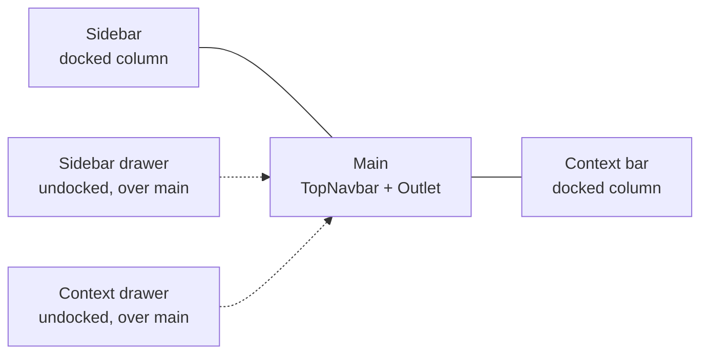

# Dashboard Builder — Project Plan

Sep 22, 2026 · @Someone

## Overview and locked decisions

A dashboard builder: an app chrome (top navbar, docking sidebar, docking context bar) around a drag-and-resize widget canvas fed by pluggable datasources. Phase 1 builds the chrome, notifications, error and loading UI; the canvas comes after.

| Decision | Choice |
| --- | --- |
| Backend | None at start; every feature has `client / dto / mapper`, persistence behind a `DashboardRepository` port |
| Persistence | JSON files in `/data/dashboards` and `/data/templates`, localStorage holds the unsaved draft, versioned schema with migrations |
| Panel group | One `container` widget: `row` (collapsible section, first) and `grid` (nested sub-dashboard, second) |
| Charts | `@mantine/charts` (Recharts) as default; registry allows uPlot later |
| User | Placeholder via a `CurrentUser` context, no auth |
| Time range | Global picker in v1, in every query key; template variables get a schema slot now, UI in phase 4 |
| Responsive | Desktop builder (`md+`), smaller screens view-only, layouts stored per breakpoint |
| Undo/redo | Yes: dashboard document is one immutable slice edited via immer, `zundo` temporal middleware |
| Structure | Light feature-based folders, single Vite app, no monorepo yet |
| Code style | Vercel composition patterns and react-best-practices, installed as agent skills |

## Stack

React 19 is required by Mantine 9, so all React 19 APIs (`ref` as prop, `use()`, `Activity`, `useEffectEvent`) are fair game from day one.

| Area | Package | Notes |
| --- | --- | --- |
| Build | Vite, TypeScript strict, pnpm | `vite-tsconfig-paths` for `@/features/*` aliases |
| UI | `@mantine/core` 9.6.2, `hooks`, `notifications`, `modals`, `dates`, `charts`, `spotlight` | Spotlight drives the navbar search; `postcss-preset-mantine` |
| Routing | `@tanstack/react-router` | File-based routes, `staticData` declares context-bar tabs |
| Data | `@tanstack/react-query` | One `QueryClient`, `useQueries` for widgets |
| State | `zustand` + `immer` + `zundo` | Shell store (persisted) and dashboard store (temporal) |
| Grid | `react-grid-layout` 2.x | v2 API only, never `/legacy`; constraints and `extras` compactors |
| Schemas | `zod` | Dashboard, widget options, datasource config, DTOs |
| Tables / nodes / md | `@tanstack/react-table`, `@xyflow/react`, `react-markdown` | Each a lazy chunk |
| Icons | `@tabler/icons-react` | Direct file imports, no barrel |
| Tooling | Storybook, Vitest + Testing Library, MSW, Playwright (later) | Storybook covers every chrome state |

Verified 22 Sep 2026: react-grid-layout 2.2.3 is current ([releases](https://github.com/react-grid-layout/react-grid-layout/releases)); Mantine 9.4+ ships Menubar, DataList, EmptyState and ComboboxPopover ([changelog](https://mantine.dev/changelog/all-releases/)).

## Project structure

Light feature-based layout: one folder per feature, four fixed sub-folders, no layers or slices beyond that.

```markdown
src/
  app/              providers.tsx, router.tsx, query-client.ts, App.tsx
  design-system/    tokens/, theme/, components/ (extended Mantine), index.ts
  shared/           DataFrame, hooks, utils, types — no UI, no feature imports
  features/
    shell/          navbar/, sidebar/, context-bar/, panel/, model/, store.ts
    notifications/  notify.ts, components/, model/
    errors/         ErrorBoundary, NotFound, RouteError, WidgetError, Offline
    loading/        skeletons/, PendingRoute, useDelayedPending
    dashboard/      model/ (schema, migrations), store.ts, grid/, editor/
    widgets/        registry.ts, header/, chart/, table/, container/, markdown/, nodes/
    datasources/    registry.ts, local-json/, csv/, mock/, api/
    templates/
    import-export/
  routes/           TanStack file routes; thin, compose features
  data/             dashboards/*.json, templates/*.json (dev only)
```

Feature folder contract:

- `components/` UI, `hooks/`, `model/` (types + zod), `api/` (`client.ts`, `dto.ts`, `mapper.ts`); a feature that owns state adds `store.ts` and a `Provider`.
- Cross-feature imports only through the feature's `index.ts`, which re-exports types and entry components only. Inside a feature import from the file, not a barrel.
- `shared/` and `design-system/` never import from `features/`. This keeps them movable to `packages/` if a monorepo (pnpm + Turborepo) becomes needed: a second app, a backend in-repo, or publishable widget plugins.
- Route files contain no logic; they wire providers, loaders and `staticData` and render a feature entry component.

## Design system

One source of truth: `design-system/tokens` feeds the Mantine theme, and every component reads Mantine CSS variables. No inline styles, no hardcoded colors or pixel values outside `tokens/`.

| Layer | Contents |
| --- | --- |
| `tokens/` | `spacing`, `radius`, `shadows`, `zIndex` (navbar 200, sidebar 190, drawer 300, context 190, modal 400, notification 500), `shell` sizes (navbar 48px, sidebar expanded 260px / compact 56px / min 200 / max 400, context bar default 360px / min 280 / max 600), semantic colors (`surface`, `surfaceRaised`, `border`, `textMuted`, `danger`, `success`) |
| `theme/theme.ts` | `createTheme` with `primaryColor`, `defaultRadius`, `fontFamily`, `headings`; `theme.other` typed to the token object; light and dark values through `light-dark()` and `data-mantine-color-scheme` |
| `theme/components.ts` | `Button.extend`, `Paper.extend`, `NavLink.extend`, `Tabs.extend`, `Notification.extend`, `Skeleton.extend` with `defaultProps`, `classNames` (CSS modules) and `vars` resolvers |
| Variants | `Button` `ghost` and `chrome` (navbar icon buttons), `Paper` `widget` and `panel`, `NavLink` `compact` (icon-only with tooltip); declared via `vars` + `classNames`, typed through module augmentation of `ButtonProps['variant']` |
| `components/` | `Page` layout only; resizing uses Mantine `Splitter`, empty states `EmptyState`, key-value lists `DataList` |

Rules:

- Color scheme comes from `MantineProvider defaultColorScheme="auto"` plus `useMantineColorScheme`; the navbar switcher cycles light, dark, auto and stores in localStorage under the `mantine-color-scheme-value` key it already uses.
- CSS modules per component, `postcss-preset-mantine` for `light-dark()` and `rem()`; media queries use `$mantine-breakpoint-*` mixins.
- Storybook has a `Tokens` story (swatches, spacing scale, z-index ladder) and every chrome component gets a story per state. A Storybook decorator wraps `MantineProvider` with the app theme, so a component that looks wrong there is wrong.
- ESLint rule `no-restricted-syntax` blocks `style={{` outside `design-system/` and `stylelint` blocks raw hex colors.

## App chrome

Three panes on Mantine `Splitter` (9.3+): sidebar, main (navbar + content), context bar. A docked panel is a fixed-px pane; a closed or undocked panel is a 0px pane, and an undocked one renders in a `Drawer` over the content. The navbar lives inside the main pane, so a docked context bar pushes it left. `AppShell` was dropped: `Splitter` brings drag, keyboard resize and double-click reset, which `AppShell` lacks.



Solid lines are grid columns; dashed ones are overlays that do not shift the main column.

### Shell state

One Zustand store, persisted to localStorage under a versioned key (`shell.v1`), exposed only through `ShellProvider` and typed selector hooks (`useSidebar`, `useContextBar`, `useShellActions`). Components never import the store module.

```markdown
sidebar:    { mode: 'expanded' | 'compact' | 'closed', docked, width, drawerOpen* }
contextBar: { open, docked, width, activeTab, drawerOpen* }
narrow*:    boolean                      // viewport below md, synced by Shell
actions:    toggleSidebar, closeSidebar, setSidebarMode, setSidebarWidth, setSidebarDocked,
            toggleContextBar, openContextBar(tab?), closeContextBar, setContextBarWidth,
            setContextBarDocked, setActiveTab, setNarrow
* transient, never persisted
```

Rules: effective docking is `docked && !narrow`, so small screens get drawers without losing the stored preference. Drawer visibility is transient, so nothing pops open on load. `Splitter` holds sizes while dragging (no store writes per frame) and the width is committed once in `onResizeEnd`.

### Panel primitive

Sidebar and context bar are the same thing with different content, so one compound `Panel` covers both:

| Part | Role |
| --- | --- |
| `Panel.Root`, `Panel.Header`, `Panel.Body` (ScrollArea), `Panel.Footer` | Layout slots shared by sidebar and context bar |
| `Panel.DockToggle` | `ActionIcon` that flips `docked`; hidden below `md` |
| `Panel.CollapseToggle` | `ActionIcon` for expanded ↔ icon rail; only when docked |
| Resize | Mantine `Splitter` panes: min/max from tokens, arrow keys 8px (Shift 40px), double-click reset; the handle is the 1px pane border with a wider hit area |
| Overlay | Mantine `Drawer`: focus trap, Escape and outside click close it |

### Top navbar

Height 48px, inside the main column so a docked context bar pushes it left. Left to right:

| Slot | Component | Behaviour |
| --- | --- | --- |
| Burger | `Burger` | Cycles sidebar `expanded → compact → closed → expanded` when docked; toggles the drawer when undocked; `aria-expanded` reflects state |
| Search | `Spotlight` trigger styled as an input (`Kbd` Ctrl+K) | Spotlight actions come from a `searchRegistry` that features register into (dashboards, widgets, settings); router navigation on select |
| Nav select | `Select` with `Menubar`-style groups | Switches the top-level area (Dashboards, Datasources, Settings); value in shell store and mirrored to the route |
| Context button | `ActionIcon` with question-mark icon | `toggleContext()`; shows a dot badge when the active route registers a tab with `badge` (unread notifications) |
| Theme switcher | `ActionIcon` cycling light / dark / auto via `useMantineColorScheme` | Icon reflects the resolved scheme |
| User | `Menu` on an `Avatar` | Placeholder `CurrentUser`; items: profile, sign out (no-op) |

All icon buttons are Mantine `ActionIcon` (`variant="subtle"`, size `lg`) wrapped in `Tooltip` with an `aria-label`.

### Sidebar

| State | Rendering |
| --- | --- |
| Expanded, docked | Column at `width`, `NavLink` with icon + label, groups collapsible, splitter on right edge |
| Compact, docked | 56px column, icon-only `NavLink` variant `compact`, label in a right-side Tooltip, no splitter |
| Closed | No column; burger reopens |
| Undocked (any mode) | Left `Drawer`, closes on outside click or Escape; the burger and the dock toggle are the only ways to open it |

Footer holds `Panel.DockToggle` and a collapse toggle. Nav items come from a typed `navConfig` array (`{ id, label, icon, to, group }`) so the compact and expanded variants render the same data. Active state comes from the router (`useMatchRoute`), not the store.

### Context bar

| State | Rendering |
| --- | --- |
| Open, docked | Right column full height, navbar shifts left, splitter on left edge, `Tabs` header |
| Open, undocked | Right `Drawer`, closes on outside click or Escape |
| Closed | No column; context button reopens on the last `activeTab` |

Tabs are contextual. Each route declares them in `staticData.contextTabs: ContextTab[]` where `ContextTab = { id, label, icon, component: lazy, badge?: () => number }`. `useContextTabs()` reads `useMatches()`, merges from root to leaf, and appends the global `notifications` tab last. When the active tab disappears on navigation, fall back to the first tab. Tab panels that are hidden render inside React 19 `Activity mode="hidden"` so their state survives switching. The dashboard editor later mounts its widget and datasource editors here as tabs.

The tabs sit in the header row next to dock and close, so there is no duplicate title. The active tab shows its label; inactive tabs are icons with tooltips, so several tabs fit in 280px. Tab badges are subscribe/snapshot pairs read with `useSyncExternalStore`, and the navbar question button sums them.

### Visual

- Top navbar: black at slight transparency (`rgba(0,0,0,0.92)`, token `shell.navbarBg`), `backdrop-filter: blur(8px)`, white icons, 1px bottom border `rgba(255,255,255,0.08)`. Same in light and dark schemes.
- Sidebar: dark gray (`dark.7` token `shell.sidebarBg`), text `gray.4`, 1px right border `dark.5`. Same in both schemes; only the main content area follows the color scheme.
- Nested nav links (Mantine `NavLink` with children): when a child is current, the parent renders white text at `fontWeight: 600` and stays expanded; the current child gets the `active` style (primary tint background, primary left border, white text). Parents without a current child use the default muted style. Implemented with `NavLink.extend` `classNames` and a `data-child-active` attribute set from `useMatchRoute`.
- Context bar: follows the color scheme (`surfaceRaised`), 1px left border.
- Compact sidebar: 56px, icon centered, label in a right Tooltip; the same active and child-active colors apply to the icon.

### Keyboard and accessibility

- `Ctrl+B` sidebar, `Ctrl+.` context bar, `Ctrl+K` search, `Escape` closes any overlay.
- Landmarks: `<header>`, `<nav aria-label="Primary">`, `<main>`, `<aside aria-label="Context">`.
- Focus returns to the trigger when an overlay closes; docked panels are never focus traps.
- Below `md` the store forces `docked: false` for both panels (overlays only), computed in a selector rather than written, so the user's docked preference survives a resize.

## Notifications

Two surfaces, one API: transient toasts (`@mantine/notifications`) and a persistent inbox in the context bar's `notifications` tab. Features call `notify.*` from `features/notifications/notify.ts`; nothing calls `notifications.show` directly.

| Level | Toast | Inbox | Auto-close | Example |
| --- | --- | --- | --- | --- |
| `success` | yes | no | 4s | Dashboard saved |
| `info` | yes | no | 5s | Layout reset |
| `warning` | yes | yes | 8s | Datasource slow, showing cached data |
| `error` | yes | yes | manual | Import failed: invalid JSON at line 12 |
| `progress` | one toast, updated by id | no | when done | Exporting 3 dashboards |

Best practices applied:

- Message shape is `{ id, level, title, message?, action?: { label, onClick }, dedupeKey?, source? }`; `title` is a plain sentence under 60 characters with the outcome first ("Dashboard saved", not "Success").
- Dedupe: a toast with the same `dedupeKey` within 10s updates the existing one instead of stacking; errors from the same widget collapse into one with a count.
- At most 3 toasts visible (`limit={3}`), bottom-right on desktop, top on `sm` and below; position from tokens.
- Every error toast has an action when one exists (Retry, Undo, Open settings); success toasts for destructive actions carry Undo for 8s, wired to the dashboard store's temporal undo.
- Accessibility: `success`/`info` use `role="status"`, `warning`/`error` use `role="alert"`; toasts pause on hover and focus; never the only signal (inline error UI still appears).
- The inbox keeps the last 50 `warning`/`error` items in the notifications store (persisted, versioned), each with `read` state; the navbar context button shows an unread badge; "Clear all" and per-item dismiss.
- Mutations use TanStack Query `onError` in a global `MutationCache` handler that calls `notify.error` with the mapped message, so features do not repeat toast logic; `onSuccess` toasts are opt-in per mutation via `meta.successMessage`.
- No toast for errors that already have a full-page or in-place UI (404, widget error boundary); those render inline instead.
- Dev mode: a `notifications` Storybook story and a `/debug/notifications` route fire every level for visual QA.

## Error UI

Errors are caught at the smallest boundary that can recover, and every boundary renders the same `ErrorState` compound component (icon, title, detail, actions) so the design stays uniform. The app chrome never unmounts because of a content error.

| Scope | Mechanism | UI |
| --- | --- | --- |
| Unknown URL | Router `notFoundComponent` on the root route | Full-content `NotFound` page (404): title, the attempted path, links Home and Back, search input |
| Route loader or render error | Router `errorComponent` per route, default on root | `RouteError` inside the main area; Retry (`router.invalidate()`), Report, expandable details in dev |
| App-level crash | `react-error-boundary` around the shell | `AppCrash` full page with Reload; logs via `onError` |
| Widget | `ErrorBoundary` per grid item plus query `isError` | `WidgetError` fills the tile: message, Retry, Edit; the rest of the dashboard keeps running |
| Datasource / query | TanStack Query `error` typed as `AppError` | Inline in the widget or editor; toast only if no inline surface |
| Form | Mantine form validation | Field-level messages, summary `Alert` on submit |
| Offline | `navigator.onLine` + `online`/`offline` events in a hook | Persistent top `Alert` ("You're offline, showing cached data"); queries pause with `networkMode: 'offlineFirst'` |
| Permission / 403 (later) | `AppError` code | `Forbidden` page variant of `ErrorState` |

Error model:

- One `AppError` type: `{ code: 'not_found' | 'network' | 'timeout' | 'validation' | 'datasource' | 'unknown', message, cause?, retryable, details? }`. Mappers in each feature's `api/` turn transport errors into `AppError`; UI never inspects `fetch` responses.
- User-facing message rules: say what happened and what to do next, no stack traces, no error codes in the title. Dev builds show a collapsible details block with the cause.
- `ErrorState` variants: `full` (page), `inline` (card or tile), `banner` (top of content). Chosen by the parent, not by boolean props.
- Retry buttons are wired to a real retry (`refetch`, `router.invalidate`, `resetErrorBoundary`) and disabled while pending.
- Global `QueryCache.onError` logs and, for background refetches only, raises a toast; initial-load errors render inline.
- Every error component has a story and a Vitest test that asserts role, message and the retry callback.

## Loading UI

Loading state matches the shape of what arrives, appears only when it would otherwise flash, and never blocks the chrome. Skeletons for initial loads, subtle indicators for refetches, transitions for navigation.

| Situation | Mechanism | UI |
| --- | --- | --- |
| Route navigation | Router `pendingComponent` + `pendingMs: 300`, `pendingMinMs: 500` | Page skeleton matching the route (list rows, dashboard grid) after 300ms; shown at least 500ms to avoid flicker |
| Route transition with data | `defaultPreload: 'intent'` (preload on hover/focus) and `useTransition` in nav links | Thin top progress bar (`NavigationProgress` from Mantine) while a transition is pending; old page stays visible |
| Widget initial data | `useQuery` `isPending` | Widget-type skeleton inside the tile: chart = axes and 3 bars, table = header + 5 rows, markdown = 4 text lines |
| Widget refetch | `isFetching && !isPending` | 2px indeterminate bar under the widget header, no skeleton |
| Lazy chunk (widget type, editor tab) | `React.lazy` + `Suspense` per tile / tab | Same skeleton as initial data, so the user cannot tell code from data loading |
| Button actions | Mutation `isPending` | Button `loading` prop, disabled, label unchanged |
| Slow queries | Timer at 5s | Skeleton gains a caption "Still loading…" and a Cancel that aborts via `AbortSignal` |
| Empty result | Query success with no rows | Mantine `EmptyState` with a hint and primary action, never a blank tile |

Rules:

- Skeleton components live in `features/loading/skeletons/` as named variants (`ChartSkeleton`, `TableSkeleton`, `TextSkeleton`, `PanelSkeleton`, `DashboardGridSkeleton`) built from `Skeleton.extend` so animation and radius come from tokens; each widget type declares which skeleton it uses in the registry.
- `useDelayedPending(isPending, 300)` gates every skeleton so sub-300ms loads render nothing; every skeleton is `aria-busy` on its container and `aria-hidden` itself, with one `visually-hidden` "Loading" per region.
- Never a full-screen spinner after the initial app boot; the boot uses a static HTML splash in `index.html` replaced on first render.
- Query defaults: `staleTime: 30s`, `gcTime: 5m`, `retry: 1` for datasources (retryable errors only), `refetchOnWindowFocus: false` for dashboards, `placeholderData: keepPreviousData` for time-range changes so charts do not skeleton on every range change.
- Non-urgent updates (search filtering, grid re-layout on resize) go through `startTransition` / `useDeferredValue`; the input stays responsive and stale content shows dimmed via `data-pending`.
- Storybook has a `Loading` group with each skeleton and a "slow network" MSW story that delays responses by 3s.

## Dashboard core (phases 3 to 6)

The dashboard is one versioned JSON document; widgets and datasources are plugins registered by type; `DataFrame` is the only contract between them.

```markdown
Dashboard  { version: 1, id, title, timeRange: { from, to, refresh? },
             variables: Variable[]  (schema reserved, UI phase 4),
             grid: { cols: { lg: 12, md: 8, sm: 4 }, rowHeight: 40 },
             layouts: Record<Breakpoint, LayoutItem[]>,
             widgets: Widget[], datasourceRefs: string[] }
Widget     { id, type, title?, options: unknown (zod per type), queries: Query[], children?: Widget[] }
Query      { id, datasourceId, spec: unknown (zod per datasource), transforms: Transform[] }
DataFrame  { columns: { name, type: 'string'|'number'|'time'|'boolean' }[], rows: unknown[][] }
```

| Concern | Approach |
| --- | --- |
| Store | Zustand slice holding the document, `immer` for edits, `zundo` for undo/redo (`limit: 50`), `dirty` flag; selectors per widget id so a change re-renders one tile |
| Grid | RGL v2 `GridLayout` with `useContainerWidth`, explicit `layout` per breakpoint, `dragConfig.handle` on the widget header, `resizeConfig` handles `se`, `constraintEnforcer` for min sizes, `fastVerticalCompactor` above 100 widgets, `isDroppable` for palette drops |
| Widget registry | `registerWidget({ type, name, icon, defaultSize, optionsSchema, component: lazy, editor: lazy, skeleton })`; `header` (sticky / large / actions as composed children), `chart`, `table`, `container` (`row` then `grid`), `markdown`, `nodes` |
| Datasource registry | `registerDatasource({ type, name, configSchema, querySchema, query(spec, ctx, signal) → DataFrame, editor: lazy, test(config) })`; `local-json`, `csv`, `mock` first; Azure SQL, Datadog, AWS, Haystack later behind an HTTP proxy adapter with the same interface |
| Fetching | `useQueries` keyed `['ds', datasourceId, hash(spec), timeRange]`, `refetchInterval` from `timeRange.refresh`, abort on unmount |
| Persistence | `DashboardRepository { list, load, save, remove }` port; `JsonFileRepository` reads `/data/*.json`, writes go to localStorage draft plus an Export action; `HttpRepository` later |
| Import / export | Dashboard JSON (with `version`, run migrations on import), widget data as CSV or JSON from the `DataFrame`, template = dashboard JSON with `template: true` and no datasource config |
| Editing | Widget palette in the context bar, selected widget's options editor as a context tab, datasource manager route, template gallery route |
| Nested grid | Inner RGL inside a `container` widget; `dragConfig.cancel` on the inner grid so outer drag does not capture; inner layouts stored on the child widget |

References: [Perses](https://github.com/perses/perses) for spec-as-code and plugin model, [Grafana](https://github.com/grafana/grafana) for `DataFrame` and panel editor UX, [Kibana](https://github.com/elastic/kibana) for the embeddable/container pattern.

## Coding rules

Two Vercel skills are installed in the repo (`npx skills add vercel-labs/agent-skills`) and summarised in `AGENTS.md`, so humans and agents follow the same rules.

Composition patterns ([source](https://github.com/vercel-labs/agent-skills/blob/main/skills/composition-patterns/SKILL.md)):

| Rule | In this project |
| --- | --- |
| `architecture-avoid-boolean-props` | No `<Sidebar compact docked />`; a parent picks `Panel.Docked` or `Panel.Overlay`, `NavLink` variant `compact` |
| `architecture-compound-components` | `Panel.*`, `TopNavbar.*`, `Widget.Header / Body / Actions`, `ErrorState.*` share context |
| `state-decouple-implementation` | Only `ShellProvider` and `DashboardProvider` know Zustand exists |
| `state-context-interface` | Providers expose `{ state, actions, meta }` |
| `state-lift-state` | Splitter width, active tab, selection live in providers, not in leaf components |
| `patterns-explicit-variants` | `ChartSkeleton` / `TableSkeleton`, `ErrorState.Full` / `.Inline` / `.Banner` instead of a `variant` boolean |
| `patterns-children-over-render-props` | `<Widget.Actions>…</Widget.Actions>`, never `renderActions` |
| `react19-no-forwardref` | `ref` as a prop, `use(Context)` |

React best practices ([source](https://github.com/vercel-labs/agent-skills/blob/main/skills/react-best-practices/SKILL.md)); the `server-*` and Next.js-specific rules do not apply to a Vite SPA. Rules that matter here:

| Rule | In this project |
| --- | --- |
| `bundle-barrel-imports`, `bundle-analyzable-paths` | Import icons and Mantine pieces from files; feature `index.ts` exports types and entry components only |
| `bundle-conditional`, `bundle-dynamic-imports` | Every widget type, datasource adapter, editor tab and heavy library (`@xyflow/react`, `react-markdown`) is a lazy chunk |
| `bundle-preload` | Router `preload: 'intent'`; palette preloads a widget's chunk on hover |
| `async-parallel` | `useQueries` for widgets, `Promise.all` in loaders |
| `async-suspense-boundaries` | Suspense per tile and per context tab, never one around the whole page |
| `client-swr-dedup` | TanStack Query with stable keys plays the SWR role |
| `client-localstorage-schema` | `shell.v1`, `dashboard-draft.v1`, `notifications.v1` keys with migrations |
| `client-passive-event-listeners`, `client-event-listeners` | One `resize`/`online` listener in a shared hook |
| `rerender-defer-reads`, `rerender-derived-state` | Selectors return booleans; store reads inside callbacks use `getState()` |
| `rerender-use-ref-transient-values`, `rerender-move-effect-to-event` | Splitter and grid drag positions in refs, commit on pointer-up |
| `rerender-no-inline-components`, `rerender-memo` | Grid tiles are `memo` components keyed by widget id; no components defined inside `map` |
| `rerender-transitions`, `rerender-use-deferred-value` | Search filtering, re-layout on resize, time-range changes |
| `rendering-activity` | Hidden context tabs and collapsed rows |
| `rendering-content-visibility` | `content-visibility: auto` on tiles below the fold |
| `rendering-conditional-render` | Ternaries, not `&&` |
| `js-set-map-lookups`, `js-index-maps` | Widgets and layouts indexed by id in the store |
| `advanced-init-once`, `advanced-use-latest` | Registries populate once at boot; `useLatest` for RGL callbacks |

Mantine-first rules (apply before writing any component):

- Read the Mantine 9.6.2 docs for the component or hook first, every time; check theming, styles API, `vars`, `classNames` and `extend` pages before adding CSS.
- Look for a Mantine component or hook before writing a custom one. Wrong: a custom button or `UnstyledButton` for the context button; wrong: a hand-made theme toggle. Right: `ActionIcon` with `Tooltip` and `aria-label` for every icon button, including the context button and the color-scheme switcher.
- Any drop-down, select or searchable list is built on Mantine `Combobox` (or `Select` / `Autocomplete`, which wrap it), never a custom popover list.
- Layout from `AppShell`, `Group`, `Stack`, `Flex`; overlays from `Drawer`, `Menu`, `Popover`; feedback from `Notification`, `Alert`, `Skeleton`, `Loader`; nav from `NavLink`, `Tabs`, `Burger`; hooks from `@mantine/hooks` (`useMove`, `useClickOutside`, `useHotkeys`, `useMediaQuery`, `useLocalStorage`).
- Load the `frontend-design` skill before designing a new screen or reshaping one.
- Naming: short and plain. `Shell`, `Sidebar`, `ContextBar`, `Splitter`, `notify`, `useShell`; no `AppShellSidebarPanelContainer`; a file is named after the one thing it exports.

Conventions: TypeScript strict with `noUncheckedIndexedAccess`; ESLint (`typescript-eslint`, `react-hooks`, `react-compiler` plugin, import-order) plus Stylelint; Prettier; Conventional Commits; one story and one test per component; `AGENTS.md` at repo root lists these rules and the folder contract.

## Roadmap

Phase 1 is the app chrome with notifications, error and loading UI on a real router, before any dashboard code. Each phase ends with Storybook stories, tests and a short review against the coding rules.

Status: phases 0 and 1 are built (22 Sep 2026). Typecheck, ESLint, Stylelint, 22 Vitest tests, production build and Storybook build all pass. Changes from the original plan:

- Mantine `Splitter` replaced `AppShell` and the custom resize handle.
- Fonts are self-hosted with Fontsource (Inter, JetBrains Mono); no runtime requests to Google.
- Vite 8 (Rolldown): tsconfig paths are native, `vite-tsconfig-paths` removed.
- The color scheme is applied by an inline script in `index.html` before first paint.
- A thin `dashboards` feature reads `public/data/dashboards/index.json` through `client → dto → mapper` to exercise loading and error paths.
- `/debug` fires every toast level, mutation error, route error, throwing widget and all skeletons.
- The app name is `appName` in `src/shared/config.ts` (placeholder: Dashboard Builder).

| Phase | Scope | Done when |
| --- | --- | --- |
| 0 Scaffold | Vite, React 19, Mantine 9.6.2, router, query, zustand, ESLint/Stylelint/Prettier, Storybook, Vitest, MSW, `AGENTS.md`, Vercel skills | `pnpm dev`, `storybook`, `test`, `lint` all green on an empty shell |
| 1 Chrome | Design system, `Panel`, top navbar, sidebar, context bar, notifications, error UI, loading UI, placeholder routes | Every chrome state has a story; keyboard and outside-click behaviour tested |
| 2 Dashboard read | Schema + migrations, `DataFrame`, `JsonFileRepository`, dashboard list and view routes, RGL v2 grid read-only, `header`, `chart`, `table` widgets, `local-json` and `mock` datasources, time-range picker | A JSON dashboard renders with live queries and skeletons |
| 3 Dashboard edit | Dashboard store with immer + zundo, drag/resize, palette in context bar, widget options editor, save to draft, export JSON | Round-trip: edit, undo, export, import identical |
| 4 Widgets and data | `container` row then grid, `markdown`, `nodes`, `csv` datasource, datasource manager, templates gallery, variables UI, CSV/JSON data export | Template creates a working dashboard in two clicks |
| 5 Persistence | `HttpRepository` behind the port, MSW-backed API, autosave, conflict toast | Switching repository is a one-line provider change |
| 6 Integrations | Backend proxy (`apps/api`, Hono), Datadog, Azure SQL, AWS, Haystack adapters, secrets never in the browser | Each adapter passes `test(config)` and a Playwright smoke test |

### Phase 1 checklist

Design system

- [ ] `tokens/` (spacing, radius, z-index, shell sizes, semantic colors) and `Tokens` story
- [ ] `theme.ts` with `createTheme`, typed `theme.other`, light/dark via `light-dark()`
- [ ] `components.ts` extensions: Button (`ghost`, `chrome`), Paper (`panel`, `widget`), NavLink (`compact`), Notification, Skeleton
- [ ] `Resizable panes via Mantine Splitter`
- [ ] Lint rules blocking inline styles and raw hex colors

Shell

- [ ] `shell/store.ts` with persist (`shell.v1`), `ShellProvider`, selector hooks
- [ ] `Panel` compound: `Root`, `Docked`, `Overlay`, `Header`, `Body`, `Footer`, `DockToggle`
- [ ] `AppShell layout="alt"` wiring with widths from the store
- [ ] Top navbar: Burger, Spotlight search + `searchRegistry`, nav Select, context button with badge, theme switcher, user menu
- [ ] Sidebar: expanded, compact, closed, undocked drawer, footer dock toggle, `navConfig`, active state from router
- [ ] Context bar: docked, undocked, closed, `Tabs`, `staticData.contextTabs`, `useContextTabs()`, `Activity` for hidden tabs
- [ ] Shortcuts `Ctrl+B`, `Ctrl+.`, `Ctrl+K`, Escape; landmarks and focus return
- [ ] Below `md`: both panels forced to overlay
- [ ] Stories: every state of each panel, plus a full-shell story with controls

Notifications

- [ ] `notify.ts` API with levels, dedupe, action, progress
- [ ] `Notifications` provider config (limit 3, position from tokens)
- [ ] Inbox store (`notifications.v1`), context tab, unread badge, clear all
- [ ] Global `MutationCache.onError` and `meta.successMessage`
- [ ] `/debug/notifications` route and story

Errors

- [ ] `AppError` type and mapper helpers in `shared/`
- [ ] `ErrorState` compound with `Full`, `Inline`, `Banner`
- [ ] `NotFound` (404), `RouteError`, `AppCrash`, `Offline` banner, `WidgetError` shell
- [ ] Router `notFoundComponent`, `errorComponent`, `react-error-boundary` at root
- [ ] Tests: role, message, retry callback for each

Loading

- [ ] Skeleton variants: `Text`, `Chart`, `Table`, `Panel`, `DashboardGrid`
- [ ] `useDelayedPending`, `NavigationProgress`, route `pendingComponent` with `pendingMs`/`pendingMinMs`
- [ ] Query client defaults (`staleTime`, `gcTime`, `retry`, `keepPreviousData`)
- [ ] Static HTML splash in `index.html`
- [ ] "Slow network" MSW story and the `Loading` story group

Routes for phase 1: `/` (redirects to `/dashboards`), `/dashboards` (placeholder list), `/dashboards/$id` (placeholder with context tabs), `/datasources`, `/settings`, `/debug/notifications`, `*` (404).

## Open questions and risks

| Item | Why it matters | Default if undecided |
| --- | --- | --- |
| Nested RGL inside `container: grid` | Two grids capturing the same pointer events; RGL has no official nesting | Ship `row` first; prototype nesting in phase 4 with `dragConfig.cancel` and a spike story |
| `AppShell` vs. hand-rolled grid | `AppShell` may fight overlay + resize combinations | Resolved: Mantine Splitter panes plus Drawer; AppShell not used. Earlier idea was to fall back to a CSS grid shell if `layout="alt"` cannot express undocked panels cleanly |
| Recharts with large series | Recharts slows past \~10k points | Downsample in a `transform` (LTTB); add uPlot widget only if needed |
| Search scope | Spotlight over dashboards only, or also widget contents and datasources | Dashboards + routes in phase 1; widgets in phase 3 |
| Nav Select semantics | Area switcher vs. workspace/tenant switcher | Area switcher; rename if tenants arrive |
| React Compiler | Removes most manual `memo`; still new | Enable the ESLint plugin now, the compiler itself after phase 2 |
| Storybook and Mantine 9 CSS layers | Stories must load the same PostCSS pipeline | Storybook uses the Vite config, verified in phase 0 |
| Undo scope | Undo for layout only, or also options and datasource edits | Whole document; exclude `timeRange` and selection from the temporal slice |

Sources: [react-grid-layout releases](https://github.com/react-grid-layout/react-grid-layout/releases), [Mantine changelog](https://mantine.dev/changelog/all-releases/), [Vercel composition patterns](https://github.com/vercel-labs/agent-skills/blob/main/skills/composition-patterns/SKILL.md), [Vercel react-best-practices](https://github.com/vercel-labs/agent-skills/blob/main/skills/react-best-practices/SKILL.md).
