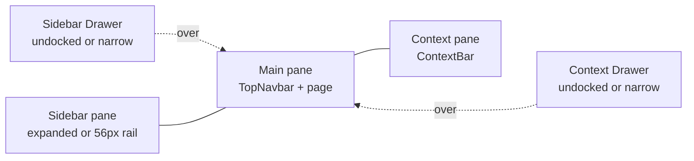
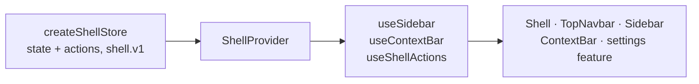
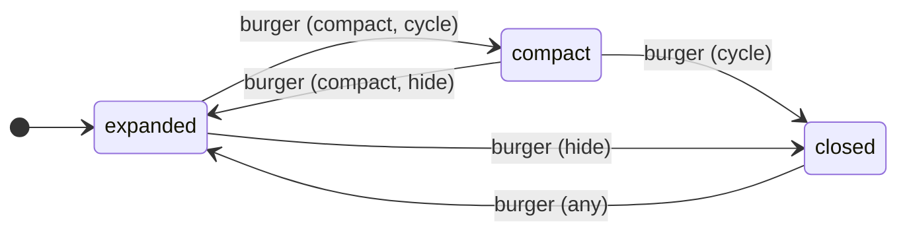
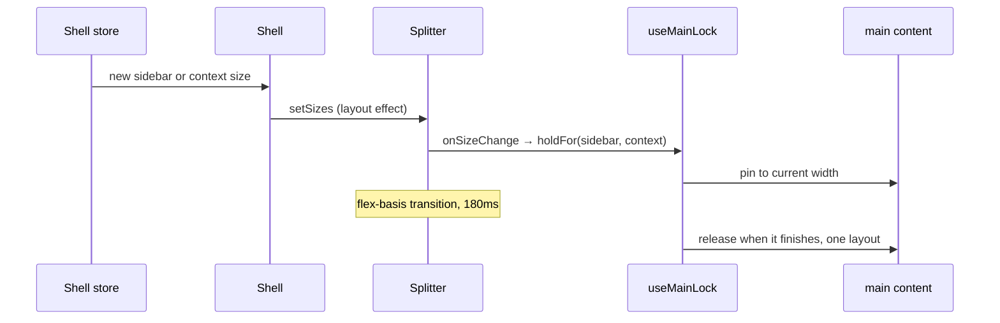

# App shell

How the chrome around every page works today: panes, state, sidebar, context bar. The original design and its reasoning are in [plan.md](plan.md#app-chrome); where the two differ, this file describes the code.

Code: `src/components/layouts/shell`. Used from outside: `Shell`, `ShellProvider` (takes `globalTabs`), `useSidebar`, `useContextBar`, `useShellActions` (`hooks/useShell.ts`), `createShellStore`. No barrel; import the file.

## Layout

Three panes on Mantine `Splitter`. A docked panel is a fixed-px pane; a closed or undocked panel is a 0px pane, and an undocked one renders in a `Drawer` instead. The navbar lives inside the main pane, so a docked context bar pushes it left.

Solid lines are `Splitter` panes side by side; dotted ones are drawers over the main pane.

| Pane                  | Width (tokens)  | Resizable                                                                 |
| --------------------- | --------------- | ------------------------------------------------------------------------- |
| Sidebar, expanded     | 260, 200 to 400 | Drag, arrows 8px, Shift+arrows 40px, Home/End, double-click resets to 260 |
| Sidebar, compact rail | 56              | No                                                                        |
| Main                  | Rest, min 360   | Through its neighbours                                                    |
| Context bar           | 360, 280 to 640 | Same as the sidebar; double-click resets to 360                           |

Below `md` (992px) both panels are drawers whatever the preference says.

## State

One Zustand store per `ShellProvider`, persisted as `shell.v1`. Only the provider knows it is Zustand; components use the hooks, which return derived values with shallow comparison.

| Derived value | Rule                                                                      |
| ------------- | ------------------------------------------------------------------------- |
| `docked`      | `sidebar.docked && !narrow`: the stored preference survives small screens |
| `isColumn`    | Docked and not closed: rendered as a pane                                 |
| `isCompact`   | Docked and `mode === 'compact'`                                           |
| `isOverlay`   | Not docked and `drawerOpen`                                               |

`drawerOpen` and `narrow` are transient and never persisted, so no drawer opens on load.

### Sidebar modes

The burger moves a docked sidebar between modes according to the user's setting (`burger`: `compact`, `hide` or `cycle`, set under Settings › Appearance). Undocked, it just opens and closes the drawer.

## Pane sizes and the main lock

Sizes flow one way at a time: store to splitter for toggles, splitter to store for user resizes. While panes move, `<main>` keeps its current width, and its content (grid, charts) lays out once, when they stop, instead of on every animation frame. Once rather than during: re-rendering a dozen charts takes about 150–250ms in a production build and would freeze the animation.

| Source                               | What happens                                                                                     |
| ------------------------------------ | ------------------------------------------------------------------------------------------------ |
| Burger, dock, close, persisted width | Store → `setSizes` → `holdFor` pins main at its current width, releases when the transition ends |
| Drag                                 | `onResizeStart` holds main at its current width; `onResizeEnd` releases it and saves the width   |
| Keyboard on a handle                 | `onSizeChange` → `holdFor` + save the width                                                      |
| Double-click on a handle             | Saves the token default; the store change then animates like a toggle                            |

While pinned, the root has `data-moving`: the main pane clips sideways instead of scrolling, and the content ignores the pointer. The release waits for the panes' transitions to finish (`getAnimations()`), with a timer as fallback. When transitions are zero (reduced motion) nothing is pinned. Details: `hooks/useMainLock.ts`.

## Sidebar

`Sidebar` composes `Panel` parts: header (brand), body (`nav.main`, scrolls), a pinned section (`nav.bottom`, never scrolls), footer (dock toggle and the `…` menu). The same component renders in the docked pane and in the drawer.

### Navigation data

`model/nav.ts` holds `nav = { main: NavGroup[], bottom: NavGroup[] }`. A group has an optional `label`; a titled group is a named `role="group"`. An item with `children` becomes a section.

To add an entry, add it to `nav.main` or `nav.bottom`. It shows up in the sidebar, the compact rail and Spotlight search.

### Compact rail

Compact is the expanded sidebar with its labels covered, not a second layout. Everything that stays visible (brand mark, nav icons, menu button) sits on the rail's center line in both modes, so collapsing only hides text and nothing moves sideways.

| Piece                      | Expanded                                           | Compact                                                                 |
| -------------------------- | -------------------------------------------------- | ----------------------------------------------------------------------- |
| Nav icon                   | Start padding `--nl-inset` puts its center at 28px | Same position                                                           |
| Label, chevron, brand name | Visible                                            | Fade out, stay in the DOM (accessible name)                             |
| Group title                | Text                                               | Short divider in the same row, so items below stay put                  |
| Leaf item                  | Link                                               | Link with a tooltip                                                     |
| Section (has children)     | Disclosure button over its child links             | Menu button: flyout with the children; disclosure closes with animation |

`--nl-inset = compact / 2 − nav padding − icon / 2`, set in `sidebar/Sidebar.module.css`.

### Active state

| Item              | Active when                                                                 |
| ----------------- | --------------------------------------------------------------------------- |
| Leaf              | Path equals `to` or starts with `to/`                                       |
| Child             | Exact match (`aria-current` on that link only)                              |
| Section, expanded | A child is current: `data-child-active` (white, heavier), no selected style |
| Section, compact  | A child is current: selected style, since the children are hidden           |

Navigating into a section opens it, so the current page is visible when the sidebar expands.

## Context bar

Tabs come from the matched routes' `staticData.contextTabs`, merged root to leaf, plus the global `notifications` tab. The active tab shows its label; the others are icons with tooltips. Inactive panels stay mounted through `Activity`, so their state survives switching. A tab can carry a badge (`subscribe` / `getSnapshot`); the navbar button shows the sum.

To add a tab for a route: `staticData: { contextTabs: [{ id, label, icon, component: lazy(...) }] }`.

## Keyboard and accessibility

| Key                               | Action                            |
| --------------------------------- | --------------------------------- |
| `Ctrl+B`                          | Burger                            |
| `Ctrl+.`                          | Context bar                       |
| `Ctrl+K`, `/`                     | Search                            |
| Arrows, Home/End on a pane handle | Resize                            |
| Enter or Space on a rail section  | Open its flyout; Escape closes it |

Landmarks: `navigation` "Primary" (sidebar pane), `main`, `complementary` "Context". A skip link goes to `#main`.

## Tests and stories

| What                                                   | Where                                                                                        |
| ------------------------------------------------------ | -------------------------------------------------------------------------------------------- |
| Store transitions                                      | `store.test.ts`                                                                              |
| Keyboard save, double-click reset                      | `Shell.test.tsx`                                                                             |
| Main lock                                              | `hooks/useMainLock.test.ts`                                                                  |
| Active states, rail flyout, bottom items, group titles | `sidebar/Sidebar.test.tsx`                                                                   |
| Every chrome state                                     | `Shell.stories.tsx` (Shell/App chrome), `sidebar/SidebarNav.stories.tsx` (Shell/Sidebar nav) |
